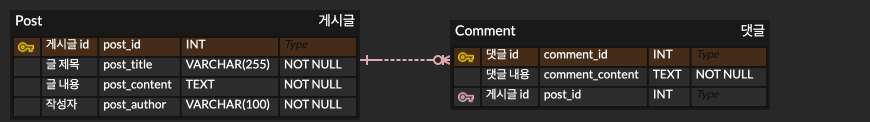

# 📝 Spring Boot RESTful API - 게시글 관리 프로젝트

## 📌 프로젝트 개요

이 프로젝트는 **Spring Boot와 JPA를 활용한 게시글 관리 RESTful API**입니다.  
사용자는 게시글을 작성하고, 조회하고, 수정하고, 삭제할 수 있습니다.

## ⚙️ 기술 스택

- 언어 : Java 17
- 프레임워크 : Spring Boot 3.3.8
- ORM (데이터베이스 매핑) : Spring Data JPA
- 데이터베이스 : H2 Database (In-memory)
- 빌드 도구 : Gradle
- 의존성 관리 : Spring Dependency Management (io.spring.dependency-management)
- 자동 코드 생성 : Lombok
- 개발 도구 : Spring Boot DevTools

## 🔗 ERD

- Post에 Comment 추가 버전 ERD
  
